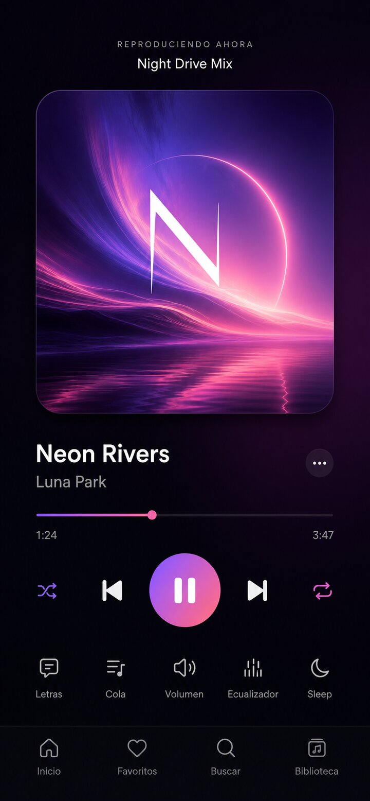
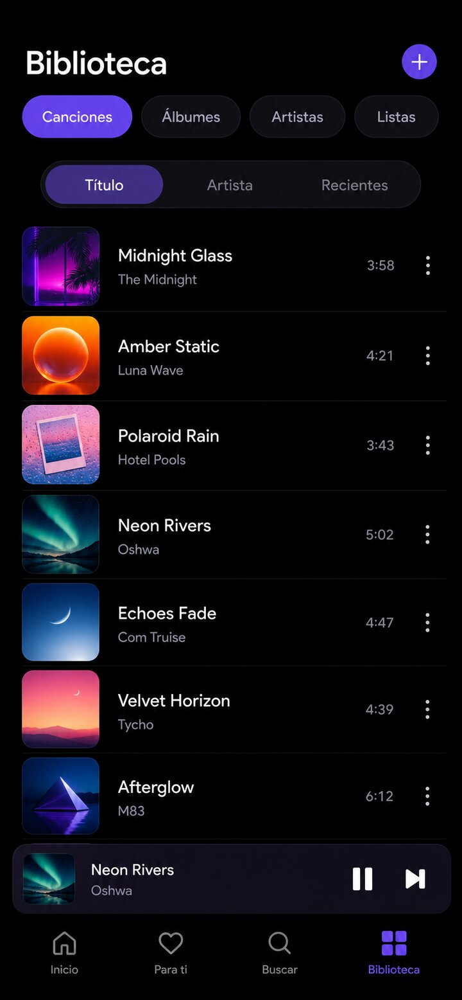
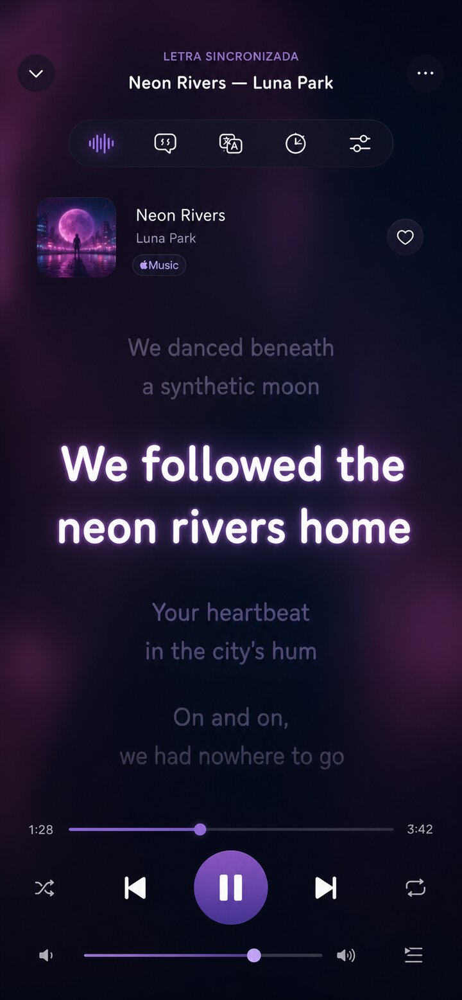

# Aurora Music Player

Reproductor de música **offline-first**. Carga archivos locales (MP3, M4A, FLAC, WAV, OGG, Opus), lee ID3 y letras LRC, y funciona sin servidor, sin cuenta y sin nube.

Abre `index.html` en el navegador. No hace falta build.

**Versión:** 1.0.0 · licencia MIT

## Capturas

| Now Playing | Biblioteca | Letras |
|---|---|---|
|  |  |  |

## Qué incluye

- Biblioteca local en IndexedDB, playlists, favoritos y cola
- Shuffle estable (Fisher–Yates), repeat, gapless, crossfade y EQ de 5 bandas
- Letras sincronizadas (LRC), editor, offset, loop y karaoke si el archivo trae tags de palabra
- Temas oscuro / claro / AMOLED, acentos e i18n (es, en, pt, zh, ja, fr, it, ru)
- Estadísticas, historial y restauración de sesión
- En escritorio (≥ 900 px): Now Playing a la izquierda y el resto a la derecha

## Uso

1. Abre `index.html`.
2. Pulsa **+** o *Cargar música* y elige archivos (o una carpeta).
3. Reproduce, crea listas y, si hay un `.lrc` junto al audio, la letra se empareja sola.

### Atajos (escritorio)

| Tecla | Acción |
|---|---|
| `Espacio` | Play / pausa |
| `←` `→` | Seek ±5 s (Shift = pista) |
| `N` / `P` | Siguiente / anterior |
| `↑` `↓` | Volumen |
| `M` | Silencio |
| `L` | Favorito |
| `Esc` | Cierra paneles |
| `?` | Esta ayuda |

## Tests

```bash
# Auditoría i18n (falla si una clave no tiene los 8 idiomas)
node audit-i18n.js

# Suite en el navegador: parseLrc, shuffle, fmtTime, duplicados, i18n
# Abre tests.html
```

## Empaquetar como WebXDC (opcional)

Sigue siendo un `.xdc` válido para Delta Chat, **sin sincronización P2P**: cada dispositivo reproduce su propia biblioteca.

```bash
python3 build-xdc.py
```

Salida: `aurora-music-player.xdc`. En webxdc se mantiene el marco móvil (no el layout desktop).

## Licencia

MIT. Ver `LICENSE`.
